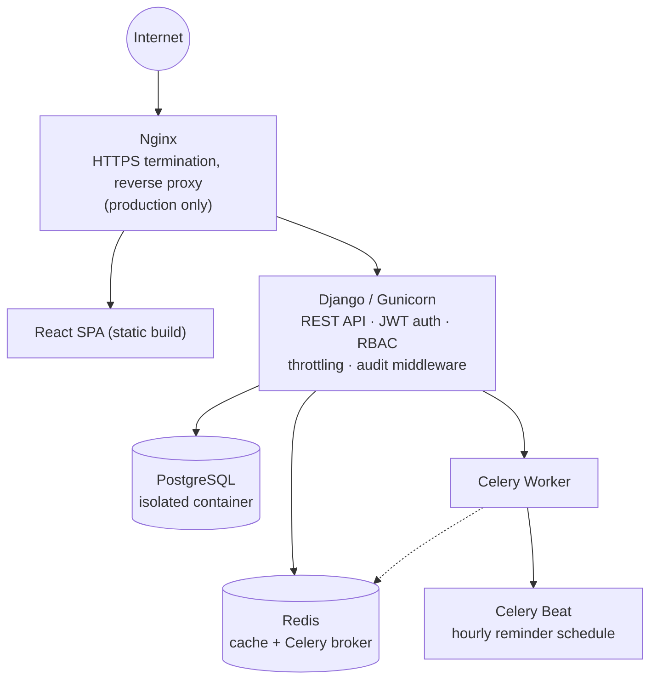

# Architecture

## Request flow (production)



The same flow, with the full label detail:

```
                    Internet
                       │
                       ▼
                    Nginx            (HTTPS termination, serves the React build, reverse-proxies
                       │              /api|/admin|/health to Django — production only)
        ┌──────────────┴──────────────┐
        ▼                             ▼
  React SPA (static)           Django / Gunicorn   (REST API, JWT auth, RBAC, throttling, audit middleware)
                                       │
                       ┌───────────────┼──────────────┐
                       ▼               ▼              ▼
                  PostgreSQL         Redis          Celery Worker
                  (isolated          (cache +            │
                   container)        Celery broker)      ▼
                                                     Celery Beat  (hourly appointment-reminder schedule)
```

In local dev, Postgres/Redis run in isolated Docker containers (unique project name and ports —
deliberately separated from any other Docker projects on the same machine), while Django itself runs via
`manage.py runserver`. `docker-compose.yml` also defines `web`/`celery_worker`/`celery_beat`/`nginx`/`certbot`
services for a fully containerized production run — see [deployment.md](deployment.md) for how the two modes
(`docker-compose.override.yml`-merged dev vs. `--profile production`) coexist in the same compose file
without one leaking into the other (dev never publishes an internet-facing port; prod never skips nginx).

## Django apps

| App | Responsibility |
|---|---|
| `accounts` | Custom `User` model (role-based), JWT login, 2FA, email verification, password reset |
| `departments` | Hospital departments |
| `patients` | Patient profile, auto-created from `User` via signal |
| `doctors` | Doctor profile, availability windows, leave |
| `appointments` | Booking, slot/token generation, queue, waitlist, feedback |
| `medical_records` | EMR entries and diagnoses |
| `prescriptions` | Prescriptions + line items, PDF export |
| `laboratory` | Lab test requests and reports |
| `notifications` | In-app notifications, created internally by other apps |
| `triage` | Rule-based triage engine, AI provider settings, triage assessments, emergency guidance |
| `ai_assistant` | RAG-based patient assistant (retriever + LLM), hospital FAQ content |
| `billing` | Invoices and payments |
| `messaging` | Patient–doctor messaging, scoped to a shared appointment |
| `analytics` | Read-only aggregation endpoints for admin dashboards |
| `audit_logs` | Middleware-driven audit trail |
| `health` | `/health/*` liveness endpoints + `/metrics` (Prometheus) — see [monitoring.md](monitoring.md) |

`frontend/` (outside the Django project, a separate React/TypeScript codebase) is the UI —
see [frontend.md](frontend.md).

## AI architecture (triage)

Three layers, only the first of which is currently implemented as anything beyond a pass-through:

1. **Layer 1 — Rule engine** (`triage/rules_engine.py`): keyword-matches free-text symptoms against a
   seeded `Symptom` catalog, sums severity weights, and applies threshold/red-flag logic to produce an
   urgency level (`emergency` / `high` / `moderate` / `low`) and a suggested department. This is the
   authoritative layer — it runs even if the LLM is unavailable.
2. **Layer 2 — ML classifier**: **not implemented.** No validated clinical dataset exists to train one
   responsibly; see [Limitations](../README.md#limitations).
3. **Layer 3 — LLM summary** (`triage/llm.py` + `triage/tasks.py`): takes the Layer 1 output and produces a
   short, plain-language explanation for the patient. Dual-provider — **Ollama** (local) or **Groq**
   (cloud), selected at runtime via the admin-editable, Redis-cached `AIProviderSettings` singleton. Runs
   as a **background Celery task** — `POST /api/triage/assess/` returns the rule-based result immediately
   (`ai_summary_status: "pending"`), and the summary lands on the same record moments later
   (`"ready"`/`"failed"`), so a slow/unreachable LLM never blocks the response. Every triage result carries
   a fixed disclaimer (`TriageAssessment.DISCLAIMER`) — the LLM output is explanatory only and never
   overrides the Layer 1 urgency/department decision.

The AI assistant (`ai_assistant`) reuses the same `ask_llm()` provider abstraction for a separate RAG
Q&A feature — see [permissions.md](permissions.md#ai-assistant-authorization-is-never-bypassed-by-the-llm)
for how it stays permission-scoped.

## Security-relevant middleware/settings

- `audit_logs.middleware.AuditLogMiddleware` — last in `MIDDLEWARE`, logs mutating requests and login
  attempts after the view has run (so it captures the authenticated user DRF resolved), including a
  best-effort `object_id` and a redacted copy of the request body — see
  [permissions.md](permissions.md#audit-trail).
- `rest_framework_simplejwt.token_blacklist` — backs refresh-token rotation/blacklisting, plus
  `POST /api/accounts/logout-all/` (blacklists every outstanding token for the account) and 2FA recovery
  codes for account-recovery — see [authentication.md](authentication.md).
- Field-level encryption (`triage/crypto.py`, Fernet, key derived from `DJANGO_SECRET_KEY`) — used for the
  Groq API key at rest.
- `corsheaders.middleware.CorsMiddleware` — no origins are trusted by default; set `CORS_ALLOWED_ORIGINS`
  (comma-separated) once a frontend exists. Never wildcarded, since requests carry JWTs.
- `django.middleware.csp.ContentSecurityPolicyMiddleware` (Django 6.1 built-in) — applied in both DEBUG
  and production, since this backend's only HTML surfaces are the Django admin and the Swagger/ReDoc docs
  pages. `cdn.jsdelivr.net` is allow-listed for Swagger UI's JS/CSS bundles.
- `DEFAULT_THROTTLE_CLASSES` + `REST_FRAMEWORK['NUM_PROXIES']` — `NUM_PROXIES` governs how the IP-based
  rate limiter reads `X-Forwarded-For`; left unset, DRF trusts that header from *any* client, letting a
  rate limit be bypassed by simply spoofing a new fake IP per request. Set to `0` in dev (trust nothing,
  always use the direct connection) and `1` in production (trust exactly the one hop Nginx adds — see
  Phase 9).
- Production-only hardening block in `settings.py` (`if not DEBUG:`) — HSTS, secure + HttpOnly cookies,
  SSL redirect, referrer policy, content-type sniffing protection.
- `AUTH_PASSWORD_VALIDATORS` — minimum length raised to 10; `PASSWORD_HASHERS` leads with Argon2
  (`argon2-cffi`) rather than Django's default PBKDF2 — see the Phase 7 report for why (PBKDF2's current
  default iteration count made hashing multiple seconds slow on constrained hardware).
- File uploads (`laboratory.LabReport.report_file`, `messaging.Message.attachment`) are extension- and
  size-limited via `FileExtensionValidator` + `MaxFileSizeValidator`
  (`ai_healthcare_triage_appointment_system/validators.py`).
- `LOGGING` — stdout-only (no in-container log files), `django.request`/`django.security` always log at
  `WARNING`+ regardless of `DJANGO_LOG_LEVEL` so unhandled view exceptions and suspicious-request
  warnings are never silently dropped — see [deployment.md](deployment.md#logging).

## API documentation stack

- **OpenAPI schema**: `drf-spectacular`, served at `/api/schema/`.
- **Swagger UI**: `/api/docs/` — interactive, supports "Authorize" with a bearer token for trying real
  requests.
- **ReDoc**: `/api/redoc/` — read-only, better for a static reference view.
- Per-app `views.py` files carry `@extend_schema`/`@extend_schema_view` decorators only where DRF can't
  auto-derive a request/response shape (plain `APIView`s with no `serializer_class`) — standard
  `ModelViewSet`s are documented automatically from their `serializer_class`.

## API versioning strategy

The API is **unversioned in the URL today** (`/api/<app>/...`) — acceptable for a project with no external
consumers yet. The agreed strategy for when a breaking change is needed:

- Introduce `/api/v2/<app>/...` alongside the existing `/api/<app>/...` (implicitly "v1"), rather than
  mutating v1 in place.
- Keep v1 running unchanged until consumers migrate; do not silently change response shapes on existing
  endpoints.
- Prefer **additive, backwards-compatible changes** (new optional fields, new endpoints) over version bumps
  wherever possible — most of this project's evolution so far (billing, messaging, analytics, waitlist,
  feedback...) has been additive for exactly this reason.
